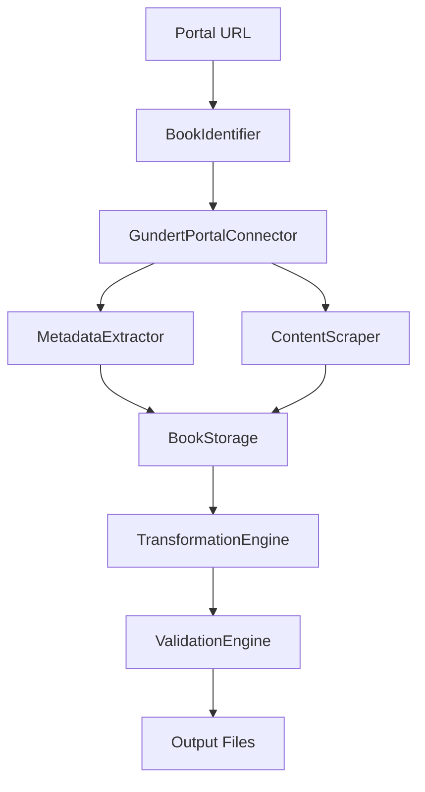

# Developer Guide 🔧

Comprehensive guide for developers contributing to or extending the Gundert Portal Scraper.

## Table of Contents

1. [Architecture Overview](#architecture-overview)
2. [Development Setup](#development-setup)
3. [API Reference](#api-reference)
4. [Plugin Development](#plugin-development)
5. [Testing Guidelines](#testing-guidelines)
6. [Contributing](#contributing)
7. [Release Process](#release-process)

## Architecture Overview

### System Design Principles

The Gundert Portal Scraper follows a **modular, plugin-based architecture** designed for:

- **Extensibility**: Easy addition of new portals, formats, and validators
- **Maintainability**: Clear separation of concerns with well-defined interfaces
- **Testability**: Comprehensive test coverage with mocking capabilities
- **Performance**: Efficient processing with async capabilities and batching
- **Academic Standards**: TEI compliance and scholarly metadata preservation

### Core Components

```
src/gundert_portal_scraper/
├── core/              # Foundation components
│   ├── book_identifier.py     # URL parsing and book ID extraction
│   ├── connection.py          # Portal connection management
│   └── exceptions.py          # Custom exception hierarchy
├── extraction/        # Content processing
│   ├── metadata.py            # Bibliographic data extraction
│   └── content.py             # Text and image content scraping
├── storage/          # Data persistence
│   ├── schemas.py             # Pydantic data models
│   ├── manager.py             # Storage coordination
│   └── formats.py             # Storage format handlers
├── transformations/  # Output format generation
│   ├── framework.py           # Plugin system base classes
│   └── plugins/               # Format-specific transformers
├── validation/       # Quality assurance
│   ├── __init__.py           # Validation engine
│   └── validators/            # Format-specific validators
├── cli/             # Command-line interface
│   ├── __init__.py           # Main CLI commands
│   └── commands.py           # Additional CLI utilities
└── preview/         # Content preview and sampling
    └── viewer.py             # Single-page preview functionality
```

### Data Flow Architecture



### Key Design Patterns

1. **Factory Pattern**: `create_transformation_engine()`, `create_validation_engine()`
2. **Strategy Pattern**: Plugin-based transformations and validations
3. **Context Manager**: `GundertPortalConnector` resource management
4. **Observer Pattern**: Progress callback system
5. **Template Method**: Base classes for transformers and validators

## Development Setup

### Environment Preparation

```bash
# Clone repository
git clone https://github.com/beniza/gundert-portal-scraper.git
cd gundert-portal-scraper

# Create development environment with uv
uv venv .venv
source .venv/bin/activate  # or `.venv\Scripts\activate` on Windows
uv sync --dev

# Install development dependencies
uv add --dev pytest pytest-cov pytest-mock black flake8 mypy

# Install pre-commit hooks (optional but recommended)
pip install pre-commit
pre-commit install
```

### Development Dependencies

```toml
[dependency-groups]
dev = [
    "pytest>=8.3.5",           # Testing framework
    "pytest-cov>=5.0.0",       # Coverage reporting
    "pytest-mock>=3.14.1",     # Mocking utilities
    "responses>=0.25.8",        # HTTP request mocking
    "selenium>=4.27.1",         # Browser automation
    "webdriver-manager>=4.0.2", # Chrome driver management
    "black>=23.0.0",           # Code formatting
    "flake8>=6.0.0",           # Linting
    "mypy>=1.0.0",             # Type checking
    "pre-commit>=3.0.0",       # Git hooks
]
```

### IDE Setup

**VS Code Configuration** (`.vscode/settings.json`):
```json
{
    "python.defaultInterpreterPath": ".venv/bin/python",
    "python.formatting.provider": "black",
    "python.linting.enabled": true,
    "python.linting.flake8Enabled": true,
    "python.testing.pytestEnabled": true,
    "python.testing.pytestArgs": ["tests"],
    "editor.formatOnSave": true
}
```

**PyCharm Configuration**:
- Set interpreter to `.venv/bin/python`
- Configure pytest as test runner
- Enable Black formatter
- Set up flake8 linting

### Running Tests

```bash
# Run all tests
uv run pytest

# Run with coverage
uv run pytest --cov=src --cov-report=html --cov-report=term

# Run specific test categories
uv run pytest -m unit          # Unit tests only
uv run pytest -m integration   # Integration tests only
uv run pytest -k "test_cli"    # Tests matching pattern

# Run with verbose output
uv run pytest -v --tb=short

# Run specific test file
uv run pytest tests/unit/test_scraper.py
```

### Code Quality Tools

```bash
# Format code with Black
uv run black src/ tests/

# Lint with flake8
uv run flake8 src/ tests/

# Type checking with mypy
uv run mypy src/

# Run all quality checks
uv run black --check src/ tests/
uv run flake8 src/ tests/
uv run mypy src/
uv run pytest --cov=src
```

## API Reference

### Core Classes

#### BookIdentifier

Parses and validates book identifiers from various portal URLs.

```python
from gundert_portal_scraper import BookIdentifier

# Initialize with URL or book ID
book = BookIdentifier("https://opendigi.ub.uni-tuebingen.de/opendigi/GaXXXIV5_1")

# Access properties
print(book.book_id)      # "GaXXXIV5_1"
print(book.portal_type)  # "opendigi"
print(book.base_url)     # Portal base URL

# Generate URLs
book_url = book.generate_book_url()
page_url = book.generate_page_url(page_number=5, tab="transcript")
```

#### GundertPortalConnector

Manages connections to digital manuscript portals with Selenium support.

```python
from gundert_portal_scraper import GundertPortalConnector

# Context manager usage (recommended)
with GundertPortalConnector(book_url, use_selenium=True) as connector:
    # Validate book access
    connector.validate_book_access()
    
    # Get page count
    total_pages = connector.get_page_count()
    
    # Navigate to specific pages
    connector.navigate_to_page(page_number=10, tab="transcript")
    
    # Check transcript availability
    has_transcripts = connector.check_transcript_availability()

# Manual resource management
connector = GundertPortalConnector(book_url)
try:
    # ... operations
finally:
    connector.close()
```

#### ContentScraper

Extracts manuscript content with line-level preservation.

```python
from gundert_portal_scraper import ContentScraper

with GundertPortalConnector(book_url) as connector:
    scraper = ContentScraper(connector, preserve_formatting=True)
    
    # Extract full book
    book_data = scraper.scrape_full_book(
        start_page=1,
        end_page=50,
        batch_size=10
    )
    
    # Extract single page
    page_data = scraper.scrape_single_page(page_number=25)
    
    # Extract with progress callback
    def progress_callback(current, total):
        print(f"Progress: {current}/{total} pages")
    
    book_data = scraper.scrape_full_book(
        progress_callback=progress_callback
    )
```

#### TransformationEngine

Converts extracted content to various output formats.

```python
from gundert_portal_scraper.transformations import create_transformation_engine
from pathlib import Path

engine = create_transformation_engine()

# Get available formats
formats = engine.get_available_formats()
print(formats)  # ['usfm', 'tei_xml', 'docx', ...]

# Transform content
result = engine.transform(
    book_storage=book_data,
    target_format='usfm',
    output_file=Path('output.usfm'),
    options={'include_images': True}
)

if result.success:
    print(f"Generated: {result.output_file}")
    print(f"Line mappings: {len(result.line_mappings)}")
else:
    print(f"Errors: {result.errors}")
```

#### ValidationEngine

Validates generated content for format compliance and quality.

```python
from gundert_portal_scraper.validation import create_validation_engine
from pathlib import Path

engine = create_validation_engine()

# Validate file
results = engine.validate_file(
    file_path=Path('output.usfm'),
    format_type='usfm'
)

for result in results:
    print(f"Validator: {result.metadata.get('validator')}")
    print(f"Valid: {result.is_valid}")
    print(f"Errors: {result.error_count}")
    print(f"Warnings: {result.warning_count}")
    
    for issue in result.issues:
        print(f"  {issue.severity.value}: {issue.message}")
        if issue.suggestion:
            print(f"    Suggestion: {issue.suggestion}")

# Validate content string
results = engine.validate_content(
    content="\\id PSA\n\\c 1\n\\v 1 Text content",
    format_type='usfm'
)
```

### Data Models

#### BookStorage Schema

Main data structure for storing extracted book content.

```python
from gundert_portal_scraper.storage import BookStorage, BookMetadata, PageContent

# Create book metadata
metadata = BookMetadata(
    book_id="PSA_example",
    title="സങ്കീർത്തനങ്ങൾ",
    portal_type="opendigi",
    content_type="biblical",
    language="malayalam"
)

# Create page content
page = PageContent(
    page_number=1,
    extraction_success=True,
    transcript_info={
        'available': True,
        'lines': [
            {'line_number': 1, 'text': 'സങ്കീർത്തനങ്ങൾ'},
            {'line_number': 2, 'text': '൧. ആശീർവാദമുള്ളവൻ...'}
        ]
    },
    image_info={
        'image_url': 'https://example.com/image.jpg',
        'width': 800,
        'height': 1200
    }
)

# Create complete book storage
book_storage = BookStorage(
    book_metadata=metadata,
    pages=[page],
    statistics=extraction_stats
)
```

### Error Handling

#### Custom Exception Hierarchy

```python
from gundert_portal_scraper.core.exceptions import (
    GundertPortalError,        # Base exception
    BookNotFoundError,         # Book doesn't exist
    ConnectionError,           # Network/portal issues
    ExtractionError,          # Content extraction problems
    TransformationError,      # Format conversion issues
    ValidationError           # Content validation failures
)

try:
    with GundertPortalConnector(url) as connector:
        book_data = scraper.scrape_full_book()
        
except BookNotFoundError as e:
    print(f"Book not found: {e}")
    
except ConnectionError as e:
    print(f"Connection failed: {e}")
    
except ExtractionError as e:
    print(f"Extraction error: {e}")
    
except GundertPortalError as e:
    print(f"General error: {e}")
```

## Plugin Development

### Creating Custom Transformers

Transformers convert extracted content to specific output formats.

#### Base Transformer Interface

```python
from gundert_portal_scraper.transformations import BaseTransformer, TransformationResult
from pathlib import Path
from typing import Dict, Any, Optional

class CustomTransformer(BaseTransformer):
    """Custom format transformer example."""
    
    def __init__(self):
        super().__init__()
        self.format_name = "custom_format"
        self.file_extension = "custom"
        self.description = "Custom format for special use cases"
    
    def transform(self, book_storage, output_file: Path, options: Optional[Dict[str, Any]] = None) -> TransformationResult:
        """Transform book content to custom format."""
        try:
            # Extract content
            content_lines = []
            line_mappings = []
            
            for page in book_storage.pages:
                if page.transcript_info.get('available'):
                    for line_data in page.transcript_info.get('lines', []):
                        formatted_line = self._format_line(line_data, options)
                        content_lines.append(formatted_line)
                        
                        # Track line mappings
                        line_mappings.append({
                            'output_line': len(content_lines),
                            'source_page': page.page_number,
                            'source_line': line_data.get('line_number')
                        })
            
            # Generate output
            final_content = self._finalize_content(content_lines, book_storage, options)
            
            # Write to file
            with open(output_file, 'w', encoding='utf-8') as f:
                f.write(final_content)
            
            return TransformationResult(
                success=True,
                output_file=output_file,
                format_name=self.format_name,
                line_mappings=line_mappings,
                metadata={'line_count': len(content_lines)}
            )
            
        except Exception as e:
            return TransformationResult(
                success=False,
                format_name=self.format_name,
                errors=[str(e)]
            )
    
    def _format_line(self, line_data: Dict, options: Optional[Dict] = None) -> str:
        """Format individual line according to custom rules."""
        text = line_data.get('text', '')
        line_num = line_data.get('line_number', 0)
        
        # Apply custom formatting logic
        if options and options.get('add_line_numbers'):
            return f"{line_num:03d}: {text}"
        return text
    
    def _finalize_content(self, lines: List[str], book_storage, options: Optional[Dict] = None) -> str:
        """Finalize content with headers, metadata, etc."""
        header = f"# {book_storage.book_metadata.title}\n"
        header += f"# Book ID: {book_storage.book_metadata.book_id}\n"
        header += f"# Generated: {datetime.now().isoformat()}\n\n"
        
        return header + '\n'.join(lines)
```

#### Registering Custom Transformers

```python
from gundert_portal_scraper.transformations import TransformationEngine

# Create engine and register custom transformer
engine = TransformationEngine()
custom_transformer = CustomTransformer()
engine.register_transformer(custom_transformer)

# Use the custom transformer
result = engine.transform(
    book_storage=book_data,
    target_format='custom_format',
    output_file=Path('output.custom')
)
```

### Creating Custom Validators

Validators ensure output quality and format compliance.

#### Base Validator Interface

```python
from gundert_portal_scraper.validation import BaseValidator, ValidationResult, ValidationIssue, ValidationSeverity
from pathlib import Path
from typing import Dict, Any, Optional, List

class CustomValidator(BaseValidator):
    """Custom format validator example."""
    
    def __init__(self):
        super().__init__()
        self.validator_name = "CustomValidator"
        self.supported_formats = ['custom_format']
        self.version = "1.0"
    
    def validate_content(self, content: str, format_type: str, options: Optional[Dict[str, Any]] = None) -> ValidationResult:
        """Validate content string."""
        issues = []
        
        # Check basic structure
        lines = content.split('\n')
        
        if not lines:
            issues.append(ValidationIssue(
                severity=ValidationSeverity.ERROR,
                code="EMPTY_CONTENT",
                message="Content is empty",
                suggestion="Ensure content was extracted properly"
            ))
        
        # Check for required header
        if not lines[0].startswith('#'):
            issues.append(ValidationIssue(
                severity=ValidationSeverity.WARNING,
                code="MISSING_HEADER",
                message="Content should start with header",
                line_number=1,
                suggestion="Add header line starting with '#'"
            ))
        
        # Check for Malayalam content
        malayalam_chars = sum(1 for char in content if '\u0d00' <= char <= '\u0d7f')
        total_chars = len(content.replace(' ', '').replace('\n', ''))
        
        if total_chars > 0:
            malayalam_percentage = (malayalam_chars / total_chars) * 100
            if malayalam_percentage < 50:
                issues.append(ValidationIssue(
                    severity=ValidationSeverity.WARNING,
                    code="LOW_MALAYALAM_CONTENT",
                    message=f"Only {malayalam_percentage:.1f}% Malayalam characters",
                    context={'malayalam_percentage': malayalam_percentage},
                    suggestion="Verify content extraction from Malayalam source"
                ))
        
        # Check line consistency
        numbered_lines = [line for line in lines if ':' in line and line.split(':')[0].isdigit()]
        if len(numbered_lines) > 0:
            expected_nums = set(range(1, len(numbered_lines) + 1))
            actual_nums = {int(line.split(':')[0]) for line in numbered_lines if line.split(':')[0].isdigit()}
            
            missing_nums = expected_nums - actual_nums
            if missing_nums:
                issues.append(ValidationIssue(
                    severity=ValidationSeverity.ERROR,
                    code="MISSING_LINE_NUMBERS",
                    message=f"Missing line numbers: {sorted(missing_nums)}",
                    suggestion="Check for gaps in line numbering sequence"
                ))
        
        return ValidationResult(
            success=len([i for i in issues if i.severity in [ValidationSeverity.ERROR, ValidationSeverity.CRITICAL]]) == 0,
            format_type=format_type,
            issues=issues,
            metadata={
                'validator': self.validator_name,
                'total_lines': len(lines),
                'malayalam_percentage': malayalam_percentage if 'malayalam_percentage' in locals() else 0
            }
        )
```

#### Registering Custom Validators

```python
from gundert_portal_scraper.validation import ValidationEngine

# Create engine and register validator
engine = ValidationEngine()
custom_validator = CustomValidator()
engine.register_validator(custom_validator, formats=['custom_format'])

# Use the validator
results = engine.validate_content(
    content=custom_content,
    format_type='custom_format'
)
```

## Testing Guidelines

### Test Structure

```
tests/
├── unit/                    # Unit tests (isolated components)
│   ├── test_book_identifier.py
│   ├── test_content_scraper.py
│   ├── test_transformers.py
│   └── test_validators.py
├── integration/            # Integration tests (component interaction)
│   ├── test_full_extraction.py
│   ├── test_cli_integration.py
│   └── test_end_to_end.py
├── fixtures/               # Test data and mock responses
│   ├── sample_pages.html
│   ├── mock_responses.json
│   └── expected_outputs/
└── conftest.py            # Pytest configuration and shared fixtures
```

### Writing Unit Tests

```python
import pytest
from unittest.mock import Mock, patch
from gundert_portal_scraper import BookIdentifier, GundertPortalConnector

class TestBookIdentifier:
    """Unit tests for BookIdentifier class."""
    
    def test_opendigi_url_parsing(self):
        """Test parsing of OpenDigi URLs."""
        url = "https://opendigi.ub.uni-tuebingen.de/opendigi/GaXXXIV5_1"
        identifier = BookIdentifier(url)
        
        assert identifier.book_id == "GaXXXIV5_1"
        assert identifier.portal_type == "opendigi"
        assert identifier.base_url == "https://opendigi.ub.uni-tuebingen.de"
    
    def test_invalid_url_handling(self):
        """Test handling of invalid URLs."""
        with pytest.raises(InvalidBookURLError):
            BookIdentifier("https://invalid-site.com/book")
    
    @pytest.mark.parametrize("url,expected_id", [
        ("https://opendigi.ub.uni-tuebingen.de/opendigi/GaXXXIV5_1", "GaXXXIV5_1"),
        ("https://opendigi.ub.uni-tuebingen.de/opendigi/GaXV2", "GaXV2"),
    ])
    def test_multiple_url_formats(self, url, expected_id):
        """Test various URL formats."""
        identifier = BookIdentifier(url)
        assert identifier.book_id == expected_id

class TestContentScraper:
    """Unit tests for ContentScraper class."""
    
    @pytest.fixture
    def mock_connector(self):
        """Create mock connector for testing."""
        connector = Mock(spec=GundertPortalConnector)
        connector.book_identifier = Mock()
        connector.book_identifier.book_id = "TEST_BOOK"
        return connector
    
    @pytest.fixture
    def sample_page_html(self):
        """Sample HTML content for testing."""
        return """
        <div id="transcript-content">
            <p>സങ്കീർത്തനങ്ങൾ</p>
            <p>൧. ആശീർവാദമുള്ളവൻ ദുഷ്ടന്മാരുടെ ആലോചനയിൽ നടക്കാതെ</p>
        </div>
        """
    
    def test_single_page_extraction(self, mock_connector, sample_page_html):
        """Test extraction of single page."""
        from gundert_portal_scraper.extraction.content import ContentScraper
        
        scraper = ContentScraper(mock_connector)
        
        # Mock the page retrieval
        with patch.object(scraper, '_get_page_html') as mock_get_html:
            mock_get_html.return_value = sample_page_html
            
            result = scraper.scrape_single_page(1)
            
            assert result['page_number'] == 1
            assert result['extraction_success'] is True
            assert len(result['transcript_info']['lines']) > 0
            assert 'സങ്കീർത്തനങ്ങൾ' in str(result['transcript_info']['lines'])
```

### Writing Integration Tests

```python
import pytest
from pathlib import Path
import tempfile
from gundert_portal_scraper import BookIdentifier, GundertPortalConnector, ContentScraper

class TestFullExtractionWorkflow:
    """Integration tests for complete extraction workflow."""
    
    @pytest.mark.integration
    @pytest.mark.slow
    def test_end_to_end_extraction(self):
        """Test complete extraction workflow."""
        # Use a known test URL (mock in CI)
        test_url = "https://opendigi.ub.uni-tuebingen.de/opendigi/GaXXXIV5_1"
        
        with tempfile.TemporaryDirectory() as temp_dir:
            output_dir = Path(temp_dir)
            
            # Full workflow test
            book_identifier = BookIdentifier(test_url)
            
            with GundertPortalConnector(book_identifier, use_selenium=False) as connector:
                scraper = ContentScraper(connector)
                
                # Extract small sample for testing
                book_data = scraper.scrape_full_book(
                    start_page=1,
                    end_page=3,  # Small sample for CI
                    batch_size=2
                )
                
                # Verify extraction results
                assert book_data['statistics']['pages_processed'] > 0
                assert book_data['statistics']['success_rate'] > 0
                
                # Test transformation
                from gundert_portal_scraper.transformations import create_transformation_engine
                engine = create_transformation_engine()
                
                result = engine.transform(
                    book_storage=book_data,
                    target_format='usfm',
                    output_file=output_dir / 'test.usfm'
                )
                
                assert result.success
                assert (output_dir / 'test.usfm').exists()
                
                # Test validation
                from gundert_portal_scraper.validation import create_validation_engine
                validation_engine = create_validation_engine()
                
                validation_results = validation_engine.validate_file(
                    file_path=output_dir / 'test.usfm',
                    format_type='usfm'
                )
                
                assert len(validation_results) > 0
                assert any(result.success for result in validation_results)
```

### Mock Data and Fixtures

```python
# conftest.py
import pytest
from pathlib import Path

@pytest.fixture
def sample_book_data():
    """Sample book data for testing transformations."""
    return {
        'book_metadata': {
            'book_id': 'TEST_PSA',
            'title': 'Test Psalms',
            'content_type': 'biblical',
            'language': 'malayalam'
        },
        'pages': [
            {
                'page_number': 1,
                'transcript_info': {
                    'available': True,
                    'lines': [
                        {'line_number': 1, 'text': 'സങ്കീർത്തനങ്ങൾ'},
                        {'line_number': 2, 'text': '൧. ആശീർവാദമുള്ളവൻ'}
                    ]
                }
            }
        ],
        'statistics': {
            'pages_processed': 1,
            'success_rate': 100.0,
            'total_lines_extracted': 2
        }
    }

@pytest.fixture
def mock_html_responses():
    """Mock HTML responses for testing."""
    return {
        'opendigi_book_page': Path('tests/fixtures/opendigi_book.html').read_text(),
        'transcript_page': Path('tests/fixtures/transcript.html').read_text(),
        'metadata_page': Path('tests/fixtures/metadata.html').read_text()
    }
```

### Running Tests in CI

```yaml
# .github/workflows/test.yml
name: Tests

on: [push, pull_request]

jobs:
  test:
    runs-on: ubuntu-latest
    strategy:
      matrix:
        python-version: [3.10, 3.11, 3.12]
    
    steps:
    - uses: actions/checkout@v4
    - name: Set up Python ${{ matrix.python-version }}
      uses: actions/setup-python@v4
      with:
        python-version: ${{ matrix.python-version }}
    
    - name: Install uv
      uses: astral-sh/setup-uv@v1
    
    - name: Install dependencies
      run: |
        uv sync --dev
    
    - name: Install Chrome for Selenium tests
      run: |
        sudo apt-get update
        sudo apt-get install -y google-chrome-stable
    
    - name: Run tests
      run: |
        uv run pytest --cov=src --cov-report=xml --cov-report=term
    
    - name: Upload coverage to Codecov
      uses: codecov/codecov-action@v3
      with:
        file: ./coverage.xml
```

## Contributing

### Contribution Guidelines

1. **Fork and Clone**:
   ```bash
   git clone https://github.com/your-username/gundert-portal-scraper.git
   cd gundert-portal-scraper
   ```

2. **Create Feature Branch**:
   ```bash
   git checkout -b feature/your-feature-name
   ```

3. **Follow Code Standards**:
   - Use Black for code formatting
   - Follow PEP 8 style guidelines
   - Add type hints to all functions
   - Write comprehensive docstrings
   - Maintain test coverage above 80%

4. **Write Tests First** (TDD):
   ```python
   def test_new_feature():
       """Test the new feature functionality."""
       # Write failing test first
       assert new_feature() == expected_result
   ```

5. **Update Documentation**:
   - Add docstrings to all public methods
   - Update relevant documentation files
   - Add examples for new features

6. **Submit Pull Request**:
   - Write clear commit messages
   - Reference related issues
   - Include test results
   - Request review from maintainers

### Code Style Standards

```python
from typing import Optional, Dict, List, Any
from pathlib import Path

class ExampleClass:
    """Example class following project standards.
    
    This class demonstrates the code style and documentation
    standards used throughout the project.
    
    Args:
        parameter1: Description of the first parameter
        parameter2: Optional second parameter with default
        
    Attributes:
        attribute1: Description of instance attribute
        attribute2: Another instance attribute
        
    Example:
        >>> example = ExampleClass("value")
        >>> result = example.process_data({"key": "value"})
        >>> print(result)
        {'processed': True}
    """
    
    def __init__(self, parameter1: str, parameter2: Optional[int] = None):
        """Initialize the example class."""
        self.attribute1 = parameter1
        self.attribute2 = parameter2 or 0
        
    def process_data(self, input_data: Dict[str, Any]) -> Dict[str, Any]:
        """Process input data and return results.
        
        Args:
            input_data: Dictionary containing data to process
            
        Returns:
            Dictionary containing processing results
            
        Raises:
            ValueError: If input_data is empty or invalid
            
        Example:
            >>> processor = ExampleClass("test")
            >>> result = processor.process_data({"item": "value"})
            >>> assert result["processed"] is True
        """
        if not input_data:
            raise ValueError("Input data cannot be empty")
            
        # Process data here
        result = {
            "processed": True,
            "input_keys": list(input_data.keys()),
            "processor_id": self.attribute1
        }
        
        return result
```

### Documentation Standards

1. **Docstring Format**: Use Google-style docstrings
2. **Type Hints**: All function parameters and returns
3. **Examples**: Include usage examples in docstrings
4. **Error Handling**: Document all exceptions that may be raised
5. **API Changes**: Update CHANGELOG.md for any API modifications

## Release Process

### Version Management

The project follows [Semantic Versioning](https://semver.org/):

- **MAJOR**: Incompatible API changes
- **MINOR**: New functionality (backward compatible)
- **PATCH**: Bug fixes (backward compatible)

### Release Steps

1. **Update Version**:
   ```bash
   # Update version in pyproject.toml
   vim pyproject.toml
   
   # Update __init__.py
   vim src/gundert_portal_scraper/__init__.py
   ```

2. **Update Changelog**:
   ```markdown
   ## [2.1.0] - 2025-10-15
   
   ### Added
   - New transformation format support
   - Enhanced validation capabilities
   
   ### Changed
   - Improved extraction performance
   - Updated CLI interface
   
   ### Fixed
   - Fixed Unicode handling issues
   - Resolved connection timeout problems
   ```

3. **Run Full Test Suite**:
   ```bash
   uv run pytest --cov=src --cov-report=term
   uv run black --check src/ tests/
   uv run flake8 src/ tests/
   uv run mypy src/
   ```

4. **Create Release**:
   ```bash
   git add .
   git commit -m "Release version 2.1.0"
   git tag -a v2.1.0 -m "Version 2.1.0 - Enhanced transformation support"
   git push origin main --tags
   ```

5. **Build and Publish**:
   ```bash
   # Build package
   uv build
   
   # Publish to PyPI (when ready)
   uv publish
   ```

### Release Checklist

- [ ] All tests passing
- [ ] Code coverage maintained
- [ ] Documentation updated
- [ ] CHANGELOG.md updated
- [ ] Version numbers incremented
- [ ] Git tags created
- [ ] GitHub release created
- [ ] PyPI package published

---

**Next**: See [API_REFERENCE.md](API_REFERENCE.md) for detailed API documentation.